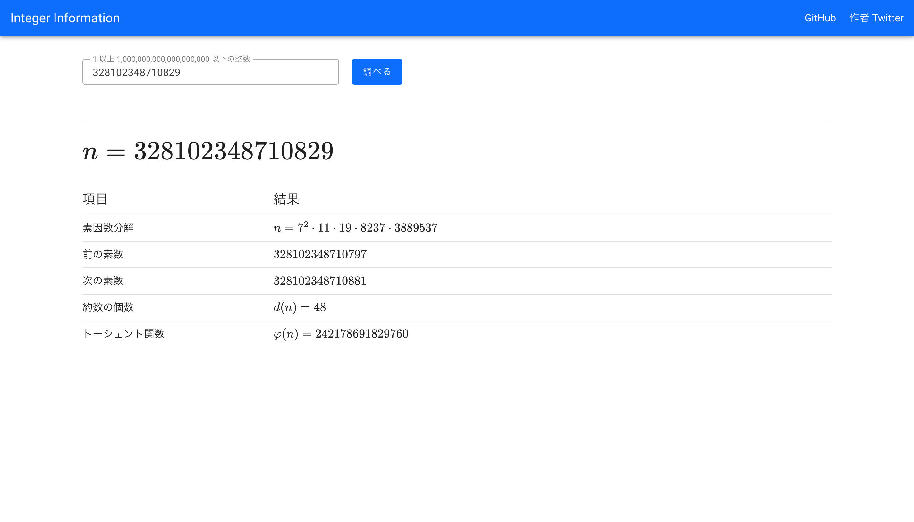

# [Integer Information](https://tiramister.net/integer/)



## これは何

整数を送信すると、その整数に関する様々な情報を出力するWebアプリケーションです。 今のところ、以下の情報を出力します。

- 素因数分解
- 1つ前・1つ次の素数
- 約数の個数
- トーシェント関数

入力は $1$ 以上 $10^{18}$ 以下の範囲に対応しています。

欲しい機能は随時募集中です。要望や報告はこのレポジトリのissueか [作者のTwitterアカウント](https://twitter.com/mistterpp) まで。

## 実行方法

```bash
# 依存パッケージをダウンロード。
npm install

# サーバーを立てる。 localhost:3000/integer/ でアクセスできる。
npm run dev

# テスト。
npm test

# ビルド。 /dist/ 下にファイルが生成される。
npm run build
```
